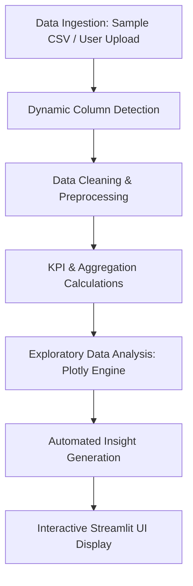

# 🚍 Public Transport Analytics Dashboard

[](https://www.python.org/)
[](https://streamlit.io/)
[](https://plotly.com/)
[](https://pandas.pydata.org/)
[](LICENSE)

An interactive, data-driven web application built for analyzing multi-modal public transportation networks. Designed specifically as a **Third Year (TY) Bachelor of Science in Data Science (BSc Data Science)** college capstone project.

---

## 📌 Project Overview

Public transit systems (city buses, rapid metro lines, suburban trains, and BRTS) are the backbone of urban mobility. Managing these large-scale networks produces vast amounts of operational data regarding daily ridership, travel delays, ticket sales, vehicle capacity, and commuter demand.

The **Public Transport Analytics Dashboard** provides transportation planners, transport authorities, and data science students with a unified, interactive platform to monitor network key performance indicators (KPIs), detect peak congestion windows, evaluate route punctuality, analyze fare revenue, and optimize fleet vehicle allocation.

---

## 🎯 Problem Statement

Urban public transport faces critical daily operational challenges:
1. **Severe Commuter Congestion**: Unpredictable passenger spikes during rush hours lead to overcrowding and uncomfortable travel.
2. **Schedule Irregularities & Delays**: Road traffic and signal congestion cause delays that compound across transit networks.
3. **Imbalanced Fleet Utilization**: Certain routes experience 110%+ passenger load, while others run near-empty, wasting fuel and operational costs.
4. **Lack of Accessible Analytics**: Transit managers often lack intuitive, dynamic dashboards to inspect daily trends and make data-driven scheduling decisions.

This project solves these challenges by ingesting operational transit logs, running an automated data cleaning and standardization pipeline, and rendering interactive visualizations and automated insights.

---

## 🎯 Objectives

- **Automated Data Cleaning**: Process raw transit trip records, remove duplicates, handle missing values, format timestamps, and filter out impossible values.
- **Dynamic Dataset Adaptation**: Automatically inspect uploaded CSV/Excel files and adapt the dashboard to available columns without crashing.
- **Temporal & Peak Hour Analysis**: Identify exact morning and evening peak windows to support schedule optimization.
- **Route Performance Benchmarking**: Rank transit routes based on passenger demand, fare collection, and average delay.
- **Transit Reliability Monitoring**: Quantify network punctuality, delay distributions, and identify bottleneck routes.
- **Fleet Utilization Assessment**: Calculate capacity utilization rates ($\frac{\text{Passengers}}{\text{Capacity}} \times 100$) to identify under-utilized and overcrowded fleet units.
- **Automated Insight Generation**: Provide decision-makers with plain-English, data-backed operational recommendations.

---

## 🚀 Key Features

| Tab / Section | Key Capabilities |
| :--- | :--- |
| **📊 Overview** | High-level KPI summary cards (Total Passengers, Total Trips, Total Revenue, Avg Load, Avg Delay, Route/Fleet count), mode share donut chart, and route performance table. |
| **👥 Passenger Trends** | Daily ridership timelines with a 7-day moving average trend line, day-of-week demand comparison, monthly growth, and passenger load distribution. |
| **🗺️ Route Performance** | Top 10 most utilized routes, bottom under-utilized routes, route revenue rankings, and average delay per route. |
| **⏰ Peak Hour Analysis** | 24-hour commuter demand curve with visual peak annotations (Morning 8–10 AM, Evening 5–7 PM), time period volume breakdown, and an hour-by-day congestion heatmap. |
| **💰 Revenue Analysis** | Total fare revenue, average revenue per trip, revenue contribution by transport mode, daily revenue trajectory, and formula transparency ($Revenue = Passengers \times Price$). |
| **⏱️ Delay & Reliability** | Average delay, max delay recorded, on-time performance percentage ($\le 3$ min delay), delay histogram, and daily delay trend. |
| **🚌 Fleet & Vehicles** | Active vehicle count, average trips per vehicle, passenger load by transit mode, and vehicle capacity utilization rate distribution. |
| **💡 Key Insights** | Real-time automated data-driven bullet points summarizing busiest routes, top revenue corridors, peak hours, and actionable management recommendations. |
| **🔍 Data Explorer** | Dual view of Cleaned vs. Raw data, before/after preprocessing audit report, text search filter, and instant Cleaned CSV download button. |

---

## 🛠️ Technologies Used

- **Programming Language**: Python 3.10+
- **Web Application Framework**: Streamlit (for building interactive web dashboards with reactive widgets)
- **Data Manipulation & Preprocessing**: 
  - **Pandas**: DataFrame wrangling, datetime extraction, aggregation, and grouping.
  - **NumPy**: Numerical operations, clipping invalid bounds, and array indexing.
- **Data Visualization**:
  - **Plotly Express & Graph Objects**: Interactive charts with hover tooltips, zooming, and dynamic scaling.
  - **Matplotlib & Seaborn**: Statistical distribution baselines and color palette palettes.
- **File I/O**: OpenPyXL (Excel support) and Python standard `csv` library.

---

## 📂 Project Structure

```
Public-Transport-Analytics/
│
├── data/
│   └── public_transport_data.csv       # Multi-modal operational sample dataset
│
├── app.py                              # Core Streamlit application (modular functions)
├── test_pipeline.py                    # Automated test suite (9 test cases)
├── generate_data.py                    # Reproducible sample dataset generator script
├── requirements.txt                    # Project Python dependencies
├── README.md                           # Project documentation & Viva Q&A
├── .gitignore                          # Git rules for bytecode, cache, and virtual environments
└── .env.example                        # Environment variable configuration template
```

---

## 📊 Dataset Description

The application supports both **custom uploaded datasets** (CSV or Excel) and a **realistic multi-modal sample dataset** (`data/public_transport_data.csv`).

### Dataset Columns Reference

| Column Name | Data Type | Description | Example Values |
| :--- | :--- | :--- | :--- |
| `trip_id` | String | Unique journey identifier | `TRIP-10001`, `TRIP-10002` |
| `date` | Date (YYYY-MM-DD) | Operational date of the trip | `2024-01-15` |
| `time` | Time (HH:MM:SS) | Scheduled departure timestamp | `08:30:00`, `18:15:00` |
| `route_id` | Categorical | Route identifier code | `BUS-101`, `METRO-BLU`, `RAIL-CST` |
| `route_name` | String | Descriptive route name | `Central Station ⇄ IT Tech Park` |
| `transport_type`| Categorical | Mode of public transit | `Bus`, `Metro`, `Suburban Rail`, `BRTS` |
| `vehicle_id` | Categorical | Fleet vehicle number | `BUS-KA01-E101`, `METRO-B-04` |
| `source_stop` | String | Origin terminus or station | `Central Railway Station` |
| `destination_stop` | String | Destination terminus or station | `Cyber City Tech Park` |
| `distance_km` | Float | Route distance in kilometers | `16.5`, `38.0` |
| `vehicle_capacity` | Integer | Total seated and standing capacity | `60` (Bus), `320` (Metro), `750` (Rail) |
| `passenger_count`| Integer | Total passengers onboard the trip | `45`, `290`, `680` |
| `ticket_price` | Float | Average ticket fare per passenger | `20.00`, `45.00` |
| `revenue` | Float | Total fare collected ($Passengers \times Price$) | `1350.00`, `11600.00` |
| `delay_minutes`| Integer | Arrival schedule delay in minutes | `0` (on-time), `12` (delayed) |
| `travel_time_mins` | Integer | Total travel time including delay | `48`, `65` |
| `status` | Categorical | Punctuality category | `On-Time`, `Moderate Delay`, `Major Delay` |

> [!NOTE]  
> **Sample Data Disclosure**: The dataset contained in `data/public_transport_data.csv` is a mathematically realistic synthetic dataset generated across 90 operational days (3,200+ trips) to simulate rush hour surges, delay patterns, and multi-modal transit metrics for educational and demonstration purposes.

---

## ⚙️ Data Preprocessing Pipeline

The preprocessing workflow follows strict Data Science best practices:

```
Raw Data Ingestion (CSV / Excel)
            ↓
Clean Column Names & Strip Whitespace
            ↓
Deduplication (Drop exact duplicate rows)
            ↓
Parse Dates & Standardize Datetime (`YYYY-MM-DD`)
            ↓
Extract Temporal Attributes (`_hour`, `_day_name`, `_month_name`, `_year_month`, `_is_weekend`)
            ↓
Sanitize Numerical Ranges (Clip negative passengers, sanitize negative fares)
            ↓
Impute Missing Numerical Values with Median
            ↓
Compute Derived Columns (Revenue = Passengers × Price; Utilization % = Passengers / Capacity × 100)
            ↓
Cleaned Dataset Ready for Analytics & Filtering
```

---

## 📈 Methodology

The complete end-to-end data lifecycle implemented in this project:



1. **Data Ingestion**: Support user-uploaded files or auto-load the 3,200+ trip multi-modal dataset.
2. **Flexible Mapping**: Synonym matching handles varying column header names (e.g., `pax` $\rightarrow$ `passenger_count`, `fare` $\rightarrow$ `ticket_price`).
3. **Exploratory Data Analysis (EDA)**: Calculate distributions, group-bys, and temporal rollups.
4. **Interactive Visualization**: Render Plotly charts with custom colorways and hover tooltips.
5. **Insights & Export**: Display automated operational takeaways and allow users to export the cleaned CSV.

---

## 💻 Installation & Setup

### Prerequisites
- Python 3.10, 3.11, or 3.12 installed on your system.
- Git installed.

### Step 1: Clone the Repository
```bash
git clone https://github.com/<your-username>/Public-Transport-Analytics.git
cd Public-Transport-Analytics
```

### Step 2: Install Dependencies
```bash
pip install -r requirements.txt
```
*(Or if using Python launcher on Windows: `py -m pip install -r requirements.txt`)*

### Step 3: Run the Automated Test Suite
```bash
python test_pipeline.py
```

### Step 4: Launch the Dashboard
```bash
streamlit run app.py
```
*(Or: `py -m streamlit run app.py`)*

The dashboard will open automatically in your browser at:
`http://localhost:8501`

---

## 📋 Viva Voce Questions and Answers (25+ Questions)

### Category A: Project Fundamentals & Data Science Concepts

#### Q1: What is the main objective of your Public Transport Analytics project?
**Answer**: The main objective is to analyze urban public transit operational data (ridership, routes, revenue, and delays) to identify peak travel demand periods, benchmark route efficiency, assess punctuality, and optimize vehicle capacity allocation using interactive data visualizations.

#### Q2: Why did you choose Streamlit instead of traditional frameworks like Flask or Django?
**Answer**: Streamlit is built specifically for data science and machine learning applications. It allows rapid prototyping of interactive web apps directly in Python without writing complex HTML, CSS, or JavaScript. It natively integrates with Pandas DataFrames and interactive Plotly charts, making it ideal for exploratory dashboards.

#### Q3: What is Exploratory Data Analysis (EDA), and how did you apply it?
**Answer**: EDA is the initial process of analyzing datasets to summarize their main characteristics, uncover underlying distributions, detect outliers, and test hypotheses using summary statistics and graphical representations. In this project, EDA was applied by computing KPIs (Total Passengers, Average Load per Trip), plotting histograms of passenger distribution, and creating heatmaps of hourly commuter demand.

#### Q4: Why is data preprocessing necessary before data visualization?
**Answer**: Real-world transit data often contains missing values, inconsistent column names, invalid entries (such as negative passenger counts), and unconverted string dates. Preprocessing standardizes the data into clean numerical and datetime formats, ensuring calculations like moving averages and totals are accurate and preventing the app from crashing.

#### Q5: How did you handle missing values in your dataset?
**Answer**: Missing values in numerical columns (such as ticket price or passenger count) were imputed using the median, which is robust against extreme outliers. For categorical columns (such as route name or vehicle ID), missing values were filled with the label `'Unknown'`. Unparseable date records were safely dropped.

#### Q6: How do you detect and remove duplicate records?
**Answer**: In Pandas, duplicate records are identified using `df.duplicated()` which compares entire rows. They are removed using `df.drop_duplicates().reset_index(drop=True)` to prevent counting the same trip multiple times.

---

### Category B: Transit Analytics & Business Logic

#### Q7: What is Peak Hour Analysis, and why is it crucial for transport planning?
**Answer**: Peak hour analysis investigates the influx of commuters across the 24 hours of a day. It reveals when passenger demand is at its maximum (typically 8:00–10:00 AM for office/school rush and 5:00–7:00 PM for return commute). Transport authorities use this analysis to increase bus/train frequencies during rush hours and schedule vehicle maintenance during off-peak windows.

#### Q8: How did you identify peak hours in your code?
**Answer**: We extracted the hour component from the `time` or `date` column into an integer feature `_hour` (0 to 23). We then grouped the data by `_hour` using `df.groupby('_hour')['passenger_count'].sum()` and identified the hour with the highest total ridership using `.idxmax()`.

#### Q9: How is fare revenue calculated if the dataset lacks an explicit revenue column?
**Answer**: If an explicit revenue column is missing but `passenger_count` and `ticket_price` (or fare) are present, our dynamic preprocessing pipeline calculates estimated revenue using the formula:
$$\text{Estimated Revenue} = \text{Passenger Count} \times \text{Ticket Price}$$
The application transparently informs the user when this formula has been applied.

#### Q10: How do you measure transit reliability or punctuality?
**Answer**: Punctuality is measured using the `delay_minutes` attribute. Trips with a delay of 3 minutes or less are classified as "On-Time". We compute the On-Time Performance Percentage as:
$$\text{On-Time \%} = \left(\frac{\text{Count of Trips with Delay} \le 3}{\text{Total Completed Trips}}\right) \times 100$$

#### Q11: What is Vehicle Utilization Rate, and how is it calculated?
**Answer**: Vehicle utilization measures how effectively a transit vehicle's physical capacity is utilized during a trip:
$$\text{Utilization Rate (\%)} = \left(\frac{\text{Passenger Count}}{\text{Vehicle Capacity}}\right) \times 100$$
A rate near 100% indicates optimal usage, while rates significantly above 100% indicate overcrowding and rates below 30% indicate under-utilization.

#### Q12: How does the application dynamically adapt to different datasets?
**Answer**: The function `detect_columns(df)` uses a comprehensive dictionary of synonyms and normalized lowercase string matching to inspect incoming DataFrame headers. If a column like `revenue` or `delay_minutes` is absent, the corresponding tab displays a polite informative warning rather than throwing an unhandled Python exception.

---

### Category C: Python, Pandas, & Plotly Details

#### Q13: Why did you use Plotly instead of static Matplotlib charts?
**Answer**: Plotly generates interactive HTML5/WebGL visualizations that allow users to hover over data points to inspect exact figures, zoom into specific time intervals, toggle legends on and off, and export high-resolution PNG snapshots directly from the browser.

#### Q14: What is the purpose of `@st.cache_data` in Streamlit?
**Answer**: `@st.cache_data` is a caching decorator. When a function like `load_data()` is decorated with it, Streamlit executes the function once and stores the resulting DataFrame in memory. On subsequent user interactions (such as adjusting a sidebar filter), Streamlit fetches the data from cache instead of re-reading the CSV file from disk, greatly accelerating performance.

#### Q15: What is a 7-day rolling moving average, and why did you use it?
**Answer**: A 7-day rolling average computes the mean passenger count over a sliding 7-day window using `df[col].rolling(window=7, min_periods=1).mean()`. This smooths out short-term weekend dips and reveals the genuine underlying ridership trajectory over weeks and months.

#### Q16: What is the difference between `groupby` and `pivot_table` in Pandas?
**Answer**: `groupby()` splits data based on one or more keys and aggregates it into a single-index or multi-index series/DataFrame. `pivot_table()` reshapes data into a two-dimensional grid with rows and columns (such as Days of the Week as rows and Hours of the Day as columns), making it ideal for generating heatmaps.

#### Q17: What does `.clip(lower=min_val, upper=max_val)` do?
**Answer**: `.clip()` limits the values in a Pandas Series or NumPy array between a specified minimum and maximum threshold. Any value lower than `lower` is set to `lower`, and any value greater than `upper` is set to `upper`. We used this to eliminate impossible values like negative passenger counts.

#### Q18: How does the sidebar date filter interact with the dashboard?
**Answer**: In Streamlit's reactive model, when the user modifies the `st.sidebar.date_input`, the script re-runs from top to bottom. The active date bounds filter the DataFrame:
```python
filtered_df = cleaned_df[(cleaned_df['_extracted_date'] >= start_d) & (cleaned_df['_extracted_date'] <= end_d)]
```
All KPI calculations, tabs, and Plotly charts are then computed exclusively using `filtered_df`.

---

### Category D: Project Architecture & Quality Assurance

#### Q19: How did you test your application for reliability?
**Answer**: We built an automated test suite (`test_pipeline.py`) that tests 9 distinct scenarios:
1. Loading the sample dataset.
2. Dynamic column detection accuracy.
3. Preprocessing and date parsing.
4. Correctness of KPI calculations.
5. Automated insight generation.
6. Fallback calculation when revenue is missing.
7. Graceful degradation when delay is missing.
8. Handling of empty DataFrames without crashing.
9. Ingestion of external survey Excel files.

#### Q20: What is the purpose of the `.gitignore` file?
**Answer**: `.gitignore` tells Git which files or directories to ignore and never commit to version control. This includes Python bytecode (`__pycache__/`, `*.pyc`), virtual environments (`.venv/`, `env/`), operating system metadata (`.DS_Store`, `Thumbs.db`), and secret configuration files.

#### Q21: What is the role of `requirements.txt`?
**Answer**: `requirements.txt` lists all external Python libraries and their version constraints required to execute the application. It ensures that another developer or examiner can reproduce the identical software environment using `pip install -r requirements.txt`.

#### Q22: Can your application process real-world transit data from any city?
**Answer**: Yes. As long as the data is in CSV or Excel format and contains common transit headers (such as date, route, passengers, time, or delay), the app automatically maps the columns and renders the analytics.

#### Q23: What insights can transit authorities draw from the Route Performance tab?
**Answer**: They can identify which routes have the highest passenger load (to allocate larger electric/double-decker buses or increase metro train frequency) and which routes have the worst average delays (to investigate road bottlenecks, traffic light timings, or station dwell times).

#### Q24: What is the difference between categorical and numerical variables in your dataset?
**Answer**: Numerical variables represent measurable quantities where arithmetic operations are meaningful (e.g., `passenger_count`, `revenue`, `delay_minutes`, `distance_km`). Categorical variables represent discrete groups or labels (e.g., `transport_type`, `route_name`, `status`).

#### Q25: How does this project demonstrate TY BSc Data Science competency?
**Answer**: This project demonstrates the complete end-to-end data lifecycle: data ingestion, data cleaning, defensive programming against corrupt inputs, exploratory data analysis, statistical aggregation, interactive visualization engineering, and automated business insight generation.

---

## 🚀 Future Scope

1. **Real-Time GPS & GTFS Integration**: Ingest live General Transit Feed Specification (GTFS-RT) feeds for live vehicle positions on interactive map tiles (Mapbox / Folium).
2. **Machine Learning Delay Prediction**: Train regression or ensemble models (Random Forest, XGBoost) to forecast trip arrival delays based on weather, time of day, and historical traffic patterns.
3. **Passenger Demand Forecasting**: Implement time-series forecasting (ARIMA, Prophet, or LSTM) to predict ridership 7 days in advance.
4. **Automated Route Optimization**: Use graph algorithms (Dijkstra, A*) to recommend optimal feeder bus routes that connect suburban neighborhoods to rapid metro terminals.
5. **Carbon Emission Savings Calculator**: Estimate $CO_2$ emission reductions achieved by public transit ridership compared to equivalent private vehicle trips.

---

## 📜 License

This project is licensed under the MIT License - open for educational and academic showcase.

---

## 👩‍💻 Author & Contact

- **Author**: BSc Data Science Student
- **GitHub**: [kshitijavichare2611](https://github.com/kshitijavichare2611)
- **Email**: `kshitijavichare2611@gmail.com`
